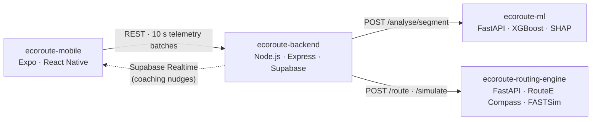

# EcoRoute Mobile

**A smartphone app that plans lower-emission driving routes, coaches drivers in real time, and reports the CO₂ of every trip, using only the phone's GPS.**

This is the mobile client for **EcoRoute**, our Final Year Project at Monash University Malaysia (2026). It is one of four services that together make up the system:

| Repo | Role |
|---|---|
| **ecoroute-mobile** (this repo) | iOS/Android app: route planning, turn-by-turn navigation, live coaching, trip history |
| [ecoroute-backend](https://github.com/bentez7/ecoroute-backend) | REST API, auth, database, orchestration (Node.js · Express · Supabase) |
| [ecoroute-ml](https://github.com/bentez7/ecoroute-ml) | Driving-behaviour classifier with explainable feedback (XGBoost · SHAP · FastAPI) |
| [ecoroute-routing-engine](https://github.com/bentez7/ecoroute-routing-engine) | Energy-aware routing and trip energy simulation (NREL RouteE Compass · FASTSim) |

---

## The problem

Aggressive acceleration, harsh braking and unstable cruising can raise a car's fuel use and CO₂ by up to 35%. Existing carbon trackers just multiply distance by an emission factor. They ignore how you actually drove and the hills you drove over, and they never tell you what to change. EcoRoute fixes that without any OBD-II dongle or extra hardware.

## What the app does

1. **Plan:** search a destination and compare three route options (*fastest*, *lowest energy*, *balanced*). Each shows distance, time, energy and CO₂, with the eco route highlighted.
2. **Drive:** turn-by-turn navigation via the Mapbox Navigation SDK. The app records GPS at 1 Hz in the background and uploads it in 10-second batches.
3. **Get coached:** if the ML service detects consistently aggressive or moderate driving, a banner appears within about a second with a specific tip (e.g. *"frequent hard braking"*) rather than an opaque score.
4. **Review:** after the trip, see the route coloured green/amber/red by driving style, its energy and CO₂, and how it compares to the eco alternative.
5. **Track:** keep a running total of your CO₂ footprint, trip history and saved vehicles.

## Architecture



Inside the app:

- **`context/active-trip.tsx`:** trip state machine. Owns the telemetry queue, the 10 s flush loop, the Realtime subscription for nudges, and post-trip polling.
- **`lib/telemetry-queue.ts`:** SQLite ring buffer, so GPS points survive bad connectivity.
- **`lib/location-task.ts`:** background location task (`expo-location` + `expo-task-manager`).
- **`lib/synth-directions.ts`:** builds a Directions-shaped response when Mapbox can't match an OSM route, so navigation never dead-ends.
- **`patches/badatgil-v2`:** patched native Mapbox Navigation module, applied on `postinstall`.

## Tech stack

Expo SDK 54 · React Native 0.81 · TypeScript · Expo Router · Mapbox (`@rnmapbox/maps` + Navigation SDK) · Supabase Auth & Realtime · expo-sqlite · expo-location / task-manager

## My contributions (Benjamin Tan)

I worked mainly on the user-facing side of the mobile app:

- **Route selection screen:** the screen that compares the three RouteE route alternatives side by side and highlights the eco option, plus the reworked home/search screen that leads into it.
- **Authentication:** email/password sign-in and sign-up with Supabase Auth, including session handling in the auth context.
- **Profile tab** and a refactor of the API client into a cleaner, class-based service layer.
- **Navigation HUD:** live speedometer, re-centre button, and speed controls for the simulated-drive test harness.
- **Day/night mode** that switches the map and UI theme automatically based on time of day.
- **Backend:** Mapbox Directions fallback in the routing helper, with a speed-band energy estimate for when the routing engine is unavailable.

Team: Teng Kong Cheng, Wong Wei Jian, Benjamin Tan En Zhe.

---

## Running it locally

The app uses native Mapbox modules, so it needs a **development build**. Expo Go won't work.

**Prerequisites:** Node 18+, Xcode (iOS) or Android Studio, a Mapbox account, and a running [ecoroute-backend](https://github.com/bentez7/ecoroute-backend).

```bash
npm install          # also applies the Mapbox navigation patch
```

Create a `.env` in the project root (never commit it):

```env
MAPBOX_PUBLIC_TOKEN=pk....            # Mapbox public token
RNMAPBOX_MAPS_DOWNLOAD_TOKEN=sk....   # Mapbox secret token with DOWNLOADS:READ
BACKEND_URL=http://localhost:3000/api
SUPABASE_URL=https://<project-ref>.supabase.co
SUPABASE_ANON_KEY=<anon-key>
FUEL_TYPE=petrol
```

```bash
npx expo run:ios       # or: npx expo run:android
```

### Simulated test drives

`scripts/sim-drive.mjs` moves the iOS Simulator's GPS along a route, so you can test navigation and coaching at a desk:

```bash
node scripts/sim-drive.mjs              # steady drive along the default route
node scripts/sim-drive.mjs --phases     # scripted hard braking/acceleration to trigger alerts
node scripts/sim-drive.mjs --control    # live speed control at http://localhost:7777
```

## Project structure

```
app/
├── (auth)/          sign-in, sign-up
├── (tabs)/          Home, Trips, Carbon (stats), Profile
├── route-select.tsx compare route alternatives
├── navigate.tsx     turn-by-turn navigation + live coaching
├── trip-detail.tsx  post-trip review
└── my-vehicles.tsx  manage vehicles
components/          speedometer, recenter button, feedback banner, UI primitives
context/             auth + active-trip state
hooks/               theme / time-of-day scheme
lib/                 API client, Supabase, telemetry queue, location task, polyline utils
scripts/             sim-drive harness, native patch script
```
